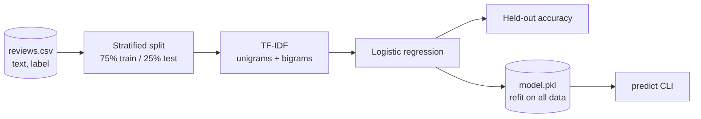

# sentiment-classifier

**A minimal, tested text-classification baseline: TF-IDF (unigrams + bigrams) into logistic regression, with a `train` / `predict` CLI.**

```
Input:  "great quality, love it"                   →  positive
Input:  "broke after a week, very disappointed"    →  negative
```

It's deliberately small: the kind of fast, explainable baseline worth having before reaching for an LLM. It's useful for checking whether a text task really needs a large model, and as a cheap fallback or pre-filter in front of one.

## How it works



1. **Load** a CSV with `text,label` columns.
2. **Split** it 75/25, stratified by label with a fixed seed, so the score is reproducible.
3. **Train** a scikit-learn pipeline (`TfidfVectorizer(ngram_range=(1, 2))` → `LogisticRegression`).
4. **Report** held-out accuracy, then **refit** on all the data and save `model.pkl`.
5. **Predict** a label for any new text from the command line.

## Results

| Dataset | Rows | Classes | Held-out accuracy |
|---|---|---|---|
| `data/reviews.csv` (bundled sample) | 190 | positive 92 / negative 98 | 1.00 |

The bundled dataset is synthetic and template-generated, so it's easy to separate. The perfect score shows the pipeline works end to end, not how it does on real-world text. Swap in your own `text,label` CSV for a real benchmark.

## Quick start

```bash
pip install -r requirements.txt

python classifier.py train --data data/reviews.csv     # held-out accuracy: 1.00; saved model.pkl
python classifier.py predict "great quality, love it"  # positive

pytest                                                 # 2 passed
```

## Tests

- `test_accuracy_reasonable`: held-out accuracy on the sample data is ≥ 0.70.
- `test_cli_roundtrip`: trains through the CLI, saves a model, and predicts `positive` for a clearly positive review.

## Layout

```
classifier.py            # load_csv, build_model, train_and_eval, CLI
data/reviews.csv         # synthetic sample dataset (text,label)
tests/test_classifier.py
requirements.txt
```

## Next steps

- Benchmark on a real dataset (e.g. IMDB or Amazon reviews) and report precision, recall and F1.
- Compare against a small transformer (DistilBERT) and an LLM zero-shot baseline.
